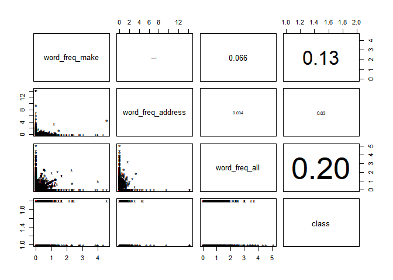
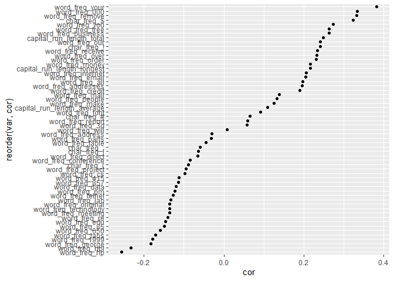
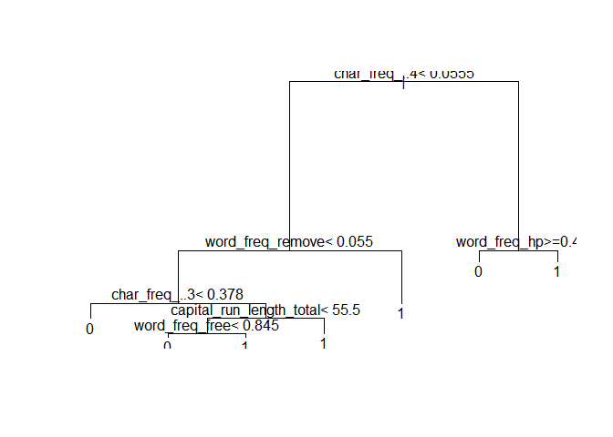
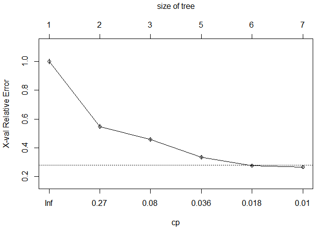
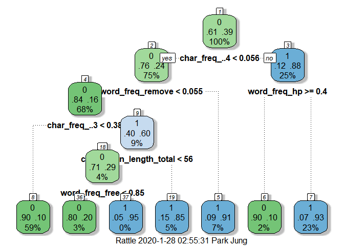
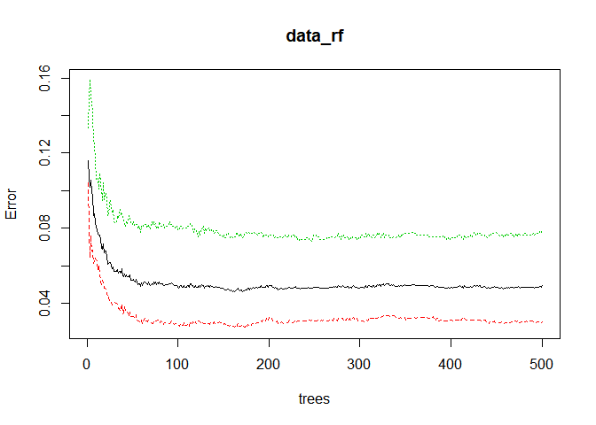
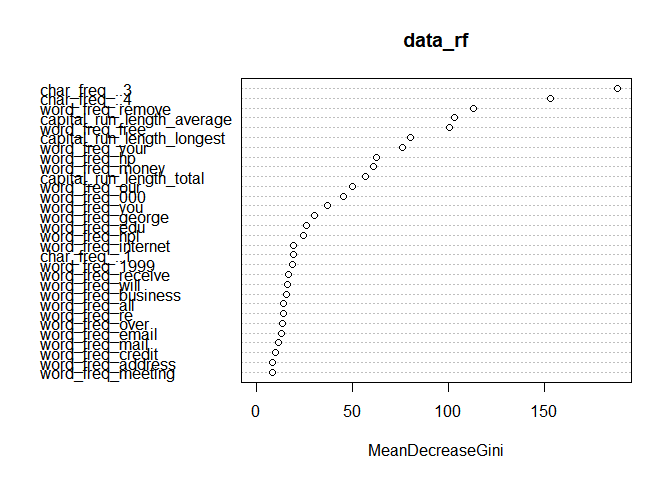

스팸 메일 분류로 배우는 머신러닝 Using R
================

안녕하세요. 이번 글에서는 [권재명](https://dataninja.me/ipds-kr/)선생님께서 쓰신 책의 주제와 코드를 중심으로

`의사결정나무(Decision Tree)`와 앙상블(Ensemble) 기법 중 하나인 `랜덤포레스트(Random Forest)`를 활용하여

스팸 메일을 분류하는 모델을 학습시켜 보도록 하겠습니다.

우선 데이터는 [CUI Machine Learning Reapository](https://archive.ics.uci.edu/ml/datasets/Spambase)에서 'spambase.data', 'spambase.names' 파일을

setwd로 설정한 디렉토리에 다운받아 저장합니다.

해당 데이터에 대한 자세한 설명은 [링크](https://docs.google.com/presentation/d/1BKo0O1ItmWXmsvab_R_wvrZCBtTVBwbhUszA1u5ZmI0/edit#slide=id.g2366bcb1b2_0_57)를 참고해주세요.

요약하자면,

-   행: 4,601(사례), 열: 58(변수/Feature)

-   58번째 Feature는 `Label Data`로 스팸인 지(spam=1) 아닌지(=0)를 나타냄

연구 절차는 다음과 같습니다.
----------------------------

-   시스템 세팅
-   데이터 이해(기초 분석 및 시각화)
-   데이터 분할
-   의사결정나무 모형(Decision Tree)
-   랜덤포레스트(Random Forest)
-   모형 평가, 해석 및 선택

### 시스템 세팅

먼저 관련 패키지를 설치하고, 불러옵니다.

``` r
#install.packages(c( "randomForest", "rpart","boot","data.table", caret" ))
#install.packages(c( "rattle", "rpart.plot", "RColorBrewer", "e1071"))

library(dplyr); library(ggplot2); library(MASS); library(randomForest); library(rpart); library(boot); library(data.table); library(caret)
```

    ## 
    ## Attaching package: 'dplyr'

    ## The following objects are masked from 'package:stats':
    ## 
    ##     filter, lag

    ## The following objects are masked from 'package:base':
    ## 
    ##     intersect, setdiff, setequal, union

    ## 
    ## Attaching package: 'MASS'

    ## The following object is masked from 'package:dplyr':
    ## 
    ##     select

    ## randomForest 4.6-14

    ## Type rfNews() to see new features/changes/bug fixes.

    ## 
    ## Attaching package: 'randomForest'

    ## The following object is masked from 'package:ggplot2':
    ## 
    ##     margin

    ## The following object is masked from 'package:dplyr':
    ## 
    ##     combine

    ## 
    ## Attaching package: 'data.table'

    ## The following objects are masked from 'package:dplyr':
    ## 
    ##     between, first, last

    ## Loading required package: lattice

    ## 
    ## Attaching package: 'lattice'

    ## The following object is masked from 'package:boot':
    ## 
    ##     melanoma

다음으로는 데이터를 로드합니다.

``` r
data <- tbl_df(read.table("spambase.data", strip.white = TRUE,
                          sep=",", header = FALSE)) #dplyr 패키지 함수 입니다.
                                                    #해당 파일이 워크디렉토리안에 저장되어 있어야 합니다. 
names(data) <- #Feature의 이름을 입력합니다.
  c('word_freq_make', 'word_freq_address', 'word_freq_all', 'word_freq_3d', 'word_freq_our',
    'word_freq_over', 'word_freq_remove', 'word_freq_internet', 'word_freq_order', 'word_freq_mail',
    'word_freq_receive', 'word_freq_will', 'word_freq_people', 'word_freq_report', 'word_freq_addresses',
    'word_freq_free', 'word_freq_business', 'word_freq_email', 'word_freq_you', 'word_freq_credit',
    'word_freq_your', 'word_freq_font', 'word_freq_000', 'word_freq_money', 'word_freq_hp',
    'word_freq_hpl', 'word_freq_george', 'word_freq_650', 'word_freq_lab', 'word_freq_labs',
    'word_freq_telnet', 'word_freq_857', 'word_freq_data', 'word_freq_415', 'word_freq_85',
    'word_freq_technology', 'word_freq_1999', 'word_freq_parts', 'word_freq_pm', 'word_freq_direct',
    'word_freq_cs', 'word_freq_meeting', 'word_freq_original', 'word_freq_project', 'word_freq_re',
    'word_freq_edu', 'word_freq_table', 'word_freq_conference', 'char_freq_;', 'char_freq_(',
    'char_freq_[', 'char_freq_!', 'char_freq_$', 'char_freq_#', 'capital_run_length_average',
    'capital_run_length_longest', 'capital_run_length_total', 'class' #class 변수가 Label Data 입니다. 
  )

data$class <- factor(data$class) #범주형 변수로 변환(스팸메일 인지/아닌지 이기 때문에 범주형 입니다.)
```

### 데이터 이해(기초 분석 및 시각화)

간단한 코드를 통해 데이터에 대한 이해를 높일 수 있습니다.

데이터의 내용을 이해하지 못하면, 머신러닝 모델 결과의 올바른 해석이 불가능합니다.

또한 상관 계수와 산점도를 확인해 보는 것도 데이터의 이해를 높이는데 좋은 방법입니다.

``` r
glimpse(data) #str(data) 비교해보는 것도 좋을 것 같습니다. 
```

    ## Observations: 4,601
    ## Variables: 58
    ## $ word_freq_make             <dbl> 0.00, 0.21, 0.06, 0.00, 0.00, 0.00, 0.00...
    ## $ word_freq_address          <dbl> 0.64, 0.28, 0.00, 0.00, 0.00, 0.00, 0.00...
    ## $ word_freq_all              <dbl> 0.64, 0.50, 0.71, 0.00, 0.00, 0.00, 0.00...
    ## $ word_freq_3d               <dbl> 0, 0, 0, 0, 0, 0, 0, 0, 0, 0, 0, 0, 0, 0...
    ## $ word_freq_our              <dbl> 0.32, 0.14, 1.23, 0.63, 0.63, 1.85, 1.92...
    ## $ word_freq_over             <dbl> 0.00, 0.28, 0.19, 0.00, 0.00, 0.00, 0.00...
    ## $ word_freq_remove           <dbl> 0.00, 0.21, 0.19, 0.31, 0.31, 0.00, 0.00...
    ## $ word_freq_internet         <dbl> 0.00, 0.07, 0.12, 0.63, 0.63, 1.85, 0.00...
    ## $ word_freq_order            <dbl> 0.00, 0.00, 0.64, 0.31, 0.31, 0.00, 0.00...
    ## $ word_freq_mail             <dbl> 0.00, 0.94, 0.25, 0.63, 0.63, 0.00, 0.64...
    ## $ word_freq_receive          <dbl> 0.00, 0.21, 0.38, 0.31, 0.31, 0.00, 0.96...
    ## $ word_freq_will             <dbl> 0.64, 0.79, 0.45, 0.31, 0.31, 0.00, 1.28...
    ## $ word_freq_people           <dbl> 0.00, 0.65, 0.12, 0.31, 0.31, 0.00, 0.00...
    ## $ word_freq_report           <dbl> 0.00, 0.21, 0.00, 0.00, 0.00, 0.00, 0.00...
    ## $ word_freq_addresses        <dbl> 0.00, 0.14, 1.75, 0.00, 0.00, 0.00, 0.00...
    ## $ word_freq_free             <dbl> 0.32, 0.14, 0.06, 0.31, 0.31, 0.00, 0.96...
    ## $ word_freq_business         <dbl> 0.00, 0.07, 0.06, 0.00, 0.00, 0.00, 0.00...
    ## $ word_freq_email            <dbl> 1.29, 0.28, 1.03, 0.00, 0.00, 0.00, 0.32...
    ## $ word_freq_you              <dbl> 1.93, 3.47, 1.36, 3.18, 3.18, 0.00, 3.85...
    ## $ word_freq_credit           <dbl> 0.00, 0.00, 0.32, 0.00, 0.00, 0.00, 0.00...
    ## $ word_freq_your             <dbl> 0.96, 1.59, 0.51, 0.31, 0.31, 0.00, 0.64...
    ## $ word_freq_font             <dbl> 0, 0, 0, 0, 0, 0, 0, 0, 0, 0, 0, 0, 0, 0...
    ## $ word_freq_000              <dbl> 0.00, 0.43, 1.16, 0.00, 0.00, 0.00, 0.00...
    ## $ word_freq_money            <dbl> 0.00, 0.43, 0.06, 0.00, 0.00, 0.00, 0.00...
    ## $ word_freq_hp               <dbl> 0, 0, 0, 0, 0, 0, 0, 0, 0, 0, 0, 0, 0, 0...
    ## $ word_freq_hpl              <dbl> 0, 0, 0, 0, 0, 0, 0, 0, 0, 0, 0, 0, 0, 0...
    ## $ word_freq_george           <dbl> 0, 0, 0, 0, 0, 0, 0, 0, 0, 0, 0, 0, 0, 0...
    ## $ word_freq_650              <dbl> 0.00, 0.00, 0.00, 0.00, 0.00, 0.00, 0.00...
    ## $ word_freq_lab              <dbl> 0, 0, 0, 0, 0, 0, 0, 0, 0, 0, 0, 0, 0, 0...
    ## $ word_freq_labs             <dbl> 0, 0, 0, 0, 0, 0, 0, 0, 0, 0, 0, 0, 0, 0...
    ## $ word_freq_telnet           <dbl> 0, 0, 0, 0, 0, 0, 0, 0, 0, 0, 0, 0, 0, 0...
    ## $ word_freq_857              <dbl> 0, 0, 0, 0, 0, 0, 0, 0, 0, 0, 0, 0, 0, 0...
    ## $ word_freq_data             <dbl> 0.00, 0.00, 0.00, 0.00, 0.00, 0.00, 0.00...
    ## $ word_freq_415              <dbl> 0, 0, 0, 0, 0, 0, 0, 0, 0, 0, 0, 0, 0, 0...
    ## $ word_freq_85               <dbl> 0, 0, 0, 0, 0, 0, 0, 0, 0, 0, 0, 0, 0, 0...
    ## $ word_freq_technology       <dbl> 0.00, 0.00, 0.00, 0.00, 0.00, 0.00, 0.00...
    ## $ word_freq_1999             <dbl> 0.00, 0.07, 0.00, 0.00, 0.00, 0.00, 0.00...
    ## $ word_freq_parts            <dbl> 0, 0, 0, 0, 0, 0, 0, 0, 0, 0, 0, 0, 0, 0...
    ## $ word_freq_pm               <dbl> 0, 0, 0, 0, 0, 0, 0, 0, 0, 0, 0, 0, 0, 0...
    ## $ word_freq_direct           <dbl> 0.00, 0.00, 0.06, 0.00, 0.00, 0.00, 0.00...
    ## $ word_freq_cs               <dbl> 0, 0, 0, 0, 0, 0, 0, 0, 0, 0, 0, 0, 0, 0...
    ## $ word_freq_meeting          <dbl> 0, 0, 0, 0, 0, 0, 0, 0, 0, 0, 0, 0, 0, 0...
    ## $ word_freq_original         <dbl> 0.00, 0.00, 0.12, 0.00, 0.00, 0.00, 0.00...
    ## $ word_freq_project          <dbl> 0.00, 0.00, 0.00, 0.00, 0.00, 0.00, 0.00...
    ## $ word_freq_re               <dbl> 0.00, 0.00, 0.06, 0.00, 0.00, 0.00, 0.00...
    ## $ word_freq_edu              <dbl> 0.00, 0.00, 0.06, 0.00, 0.00, 0.00, 0.00...
    ## $ word_freq_table            <dbl> 0, 0, 0, 0, 0, 0, 0, 0, 0, 0, 0, 0, 0, 0...
    ## $ word_freq_conference       <dbl> 0, 0, 0, 0, 0, 0, 0, 0, 0, 0, 0, 0, 0, 0...
    ## $ `char_freq_;`              <dbl> 0.000, 0.000, 0.010, 0.000, 0.000, 0.000...
    ## $ `char_freq_(`              <dbl> 0.000, 0.132, 0.143, 0.137, 0.135, 0.223...
    ## $ `char_freq_[`              <dbl> 0.000, 0.000, 0.000, 0.000, 0.000, 0.000...
    ## $ `char_freq_!`              <dbl> 0.778, 0.372, 0.276, 0.137, 0.135, 0.000...
    ## $ `char_freq_$`              <dbl> 0.000, 0.180, 0.184, 0.000, 0.000, 0.000...
    ## $ `char_freq_#`              <dbl> 0.000, 0.048, 0.010, 0.000, 0.000, 0.000...
    ## $ capital_run_length_average <dbl> 3.756, 5.114, 9.821, 3.537, 3.537, 3.000...
    ## $ capital_run_length_longest <int> 61, 101, 485, 40, 40, 15, 4, 11, 445, 43...
    ## $ capital_run_length_total   <int> 278, 1028, 2259, 191, 191, 54, 112, 49, ...
    ## $ class                      <fct> 1, 1, 1, 1, 1, 1, 1, 1, 1, 1, 1, 1, 1, 1...

``` r
summary(data)
```

    ##  word_freq_make   word_freq_address word_freq_all     word_freq_3d     
    ##  Min.   :0.0000   Min.   : 0.000    Min.   :0.0000   Min.   : 0.00000  
    ##  1st Qu.:0.0000   1st Qu.: 0.000    1st Qu.:0.0000   1st Qu.: 0.00000  
    ##  Median :0.0000   Median : 0.000    Median :0.0000   Median : 0.00000  
    ##  Mean   :0.1046   Mean   : 0.213    Mean   :0.2807   Mean   : 0.06542  
    ##  3rd Qu.:0.0000   3rd Qu.: 0.000    3rd Qu.:0.4200   3rd Qu.: 0.00000  
    ##  Max.   :4.5400   Max.   :14.280    Max.   :5.1000   Max.   :42.81000  
    ##  word_freq_our     word_freq_over   word_freq_remove word_freq_internet
    ##  Min.   : 0.0000   Min.   :0.0000   Min.   :0.0000   Min.   : 0.0000   
    ##  1st Qu.: 0.0000   1st Qu.:0.0000   1st Qu.:0.0000   1st Qu.: 0.0000   
    ##  Median : 0.0000   Median :0.0000   Median :0.0000   Median : 0.0000   
    ##  Mean   : 0.3122   Mean   :0.0959   Mean   :0.1142   Mean   : 0.1053   
    ##  3rd Qu.: 0.3800   3rd Qu.:0.0000   3rd Qu.:0.0000   3rd Qu.: 0.0000   
    ##  Max.   :10.0000   Max.   :5.8800   Max.   :7.2700   Max.   :11.1100   
    ##  word_freq_order   word_freq_mail    word_freq_receive word_freq_will  
    ##  Min.   :0.00000   Min.   : 0.0000   Min.   :0.00000   Min.   :0.0000  
    ##  1st Qu.:0.00000   1st Qu.: 0.0000   1st Qu.:0.00000   1st Qu.:0.0000  
    ##  Median :0.00000   Median : 0.0000   Median :0.00000   Median :0.1000  
    ##  Mean   :0.09007   Mean   : 0.2394   Mean   :0.05982   Mean   :0.5417  
    ##  3rd Qu.:0.00000   3rd Qu.: 0.1600   3rd Qu.:0.00000   3rd Qu.:0.8000  
    ##  Max.   :5.26000   Max.   :18.1800   Max.   :2.61000   Max.   :9.6700  
    ##  word_freq_people  word_freq_report   word_freq_addresses word_freq_free   
    ##  Min.   :0.00000   Min.   : 0.00000   Min.   :0.0000      Min.   : 0.0000  
    ##  1st Qu.:0.00000   1st Qu.: 0.00000   1st Qu.:0.0000      1st Qu.: 0.0000  
    ##  Median :0.00000   Median : 0.00000   Median :0.0000      Median : 0.0000  
    ##  Mean   :0.09393   Mean   : 0.05863   Mean   :0.0492      Mean   : 0.2488  
    ##  3rd Qu.:0.00000   3rd Qu.: 0.00000   3rd Qu.:0.0000      3rd Qu.: 0.1000  
    ##  Max.   :5.55000   Max.   :10.00000   Max.   :4.4100      Max.   :20.0000  
    ##  word_freq_business word_freq_email  word_freq_you    word_freq_credit  
    ##  Min.   :0.0000     Min.   :0.0000   Min.   : 0.000   Min.   : 0.00000  
    ##  1st Qu.:0.0000     1st Qu.:0.0000   1st Qu.: 0.000   1st Qu.: 0.00000  
    ##  Median :0.0000     Median :0.0000   Median : 1.310   Median : 0.00000  
    ##  Mean   :0.1426     Mean   :0.1847   Mean   : 1.662   Mean   : 0.08558  
    ##  3rd Qu.:0.0000     3rd Qu.:0.0000   3rd Qu.: 2.640   3rd Qu.: 0.00000  
    ##  Max.   :7.1400     Max.   :9.0900   Max.   :18.750   Max.   :18.18000  
    ##  word_freq_your    word_freq_font    word_freq_000    word_freq_money   
    ##  Min.   : 0.0000   Min.   : 0.0000   Min.   :0.0000   Min.   : 0.00000  
    ##  1st Qu.: 0.0000   1st Qu.: 0.0000   1st Qu.:0.0000   1st Qu.: 0.00000  
    ##  Median : 0.2200   Median : 0.0000   Median :0.0000   Median : 0.00000  
    ##  Mean   : 0.8098   Mean   : 0.1212   Mean   :0.1016   Mean   : 0.09427  
    ##  3rd Qu.: 1.2700   3rd Qu.: 0.0000   3rd Qu.:0.0000   3rd Qu.: 0.00000  
    ##  Max.   :11.1100   Max.   :17.1000   Max.   :5.4500   Max.   :12.50000  
    ##   word_freq_hp     word_freq_hpl     word_freq_george  word_freq_650   
    ##  Min.   : 0.0000   Min.   : 0.0000   Min.   : 0.0000   Min.   :0.0000  
    ##  1st Qu.: 0.0000   1st Qu.: 0.0000   1st Qu.: 0.0000   1st Qu.:0.0000  
    ##  Median : 0.0000   Median : 0.0000   Median : 0.0000   Median :0.0000  
    ##  Mean   : 0.5495   Mean   : 0.2654   Mean   : 0.7673   Mean   :0.1248  
    ##  3rd Qu.: 0.0000   3rd Qu.: 0.0000   3rd Qu.: 0.0000   3rd Qu.:0.0000  
    ##  Max.   :20.8300   Max.   :16.6600   Max.   :33.3300   Max.   :9.0900  
    ##  word_freq_lab      word_freq_labs   word_freq_telnet   word_freq_857    
    ##  Min.   : 0.00000   Min.   :0.0000   Min.   : 0.00000   Min.   :0.00000  
    ##  1st Qu.: 0.00000   1st Qu.:0.0000   1st Qu.: 0.00000   1st Qu.:0.00000  
    ##  Median : 0.00000   Median :0.0000   Median : 0.00000   Median :0.00000  
    ##  Mean   : 0.09892   Mean   :0.1029   Mean   : 0.06475   Mean   :0.04705  
    ##  3rd Qu.: 0.00000   3rd Qu.:0.0000   3rd Qu.: 0.00000   3rd Qu.:0.00000  
    ##  Max.   :14.28000   Max.   :5.8800   Max.   :12.50000   Max.   :4.76000  
    ##  word_freq_data     word_freq_415      word_freq_85     word_freq_technology
    ##  Min.   : 0.00000   Min.   :0.00000   Min.   : 0.0000   Min.   :0.00000     
    ##  1st Qu.: 0.00000   1st Qu.:0.00000   1st Qu.: 0.0000   1st Qu.:0.00000     
    ##  Median : 0.00000   Median :0.00000   Median : 0.0000   Median :0.00000     
    ##  Mean   : 0.09723   Mean   :0.04784   Mean   : 0.1054   Mean   :0.09748     
    ##  3rd Qu.: 0.00000   3rd Qu.:0.00000   3rd Qu.: 0.0000   3rd Qu.:0.00000     
    ##  Max.   :18.18000   Max.   :4.76000   Max.   :20.0000   Max.   :7.69000     
    ##  word_freq_1999  word_freq_parts   word_freq_pm      word_freq_direct 
    ##  Min.   :0.000   Min.   :0.0000   Min.   : 0.00000   Min.   :0.00000  
    ##  1st Qu.:0.000   1st Qu.:0.0000   1st Qu.: 0.00000   1st Qu.:0.00000  
    ##  Median :0.000   Median :0.0000   Median : 0.00000   Median :0.00000  
    ##  Mean   :0.137   Mean   :0.0132   Mean   : 0.07863   Mean   :0.06483  
    ##  3rd Qu.:0.000   3rd Qu.:0.0000   3rd Qu.: 0.00000   3rd Qu.:0.00000  
    ##  Max.   :6.890   Max.   :8.3300   Max.   :11.11000   Max.   :4.76000  
    ##   word_freq_cs     word_freq_meeting word_freq_original word_freq_project
    ##  Min.   :0.00000   Min.   : 0.0000   Min.   :0.0000     Min.   : 0.0000  
    ##  1st Qu.:0.00000   1st Qu.: 0.0000   1st Qu.:0.0000     1st Qu.: 0.0000  
    ##  Median :0.00000   Median : 0.0000   Median :0.0000     Median : 0.0000  
    ##  Mean   :0.04367   Mean   : 0.1323   Mean   :0.0461     Mean   : 0.0792  
    ##  3rd Qu.:0.00000   3rd Qu.: 0.0000   3rd Qu.:0.0000     3rd Qu.: 0.0000  
    ##  Max.   :7.14000   Max.   :14.2800   Max.   :3.5700     Max.   :20.0000  
    ##   word_freq_re     word_freq_edu     word_freq_table    word_freq_conference
    ##  Min.   : 0.0000   Min.   : 0.0000   Min.   :0.000000   Min.   : 0.00000    
    ##  1st Qu.: 0.0000   1st Qu.: 0.0000   1st Qu.:0.000000   1st Qu.: 0.00000    
    ##  Median : 0.0000   Median : 0.0000   Median :0.000000   Median : 0.00000    
    ##  Mean   : 0.3012   Mean   : 0.1798   Mean   :0.005444   Mean   : 0.03187    
    ##  3rd Qu.: 0.1100   3rd Qu.: 0.0000   3rd Qu.:0.000000   3rd Qu.: 0.00000    
    ##  Max.   :21.4200   Max.   :22.0500   Max.   :2.170000   Max.   :10.00000    
    ##   char_freq_;       char_freq_(     char_freq_[       char_freq_!     
    ##  Min.   :0.00000   Min.   :0.000   Min.   :0.00000   Min.   : 0.0000  
    ##  1st Qu.:0.00000   1st Qu.:0.000   1st Qu.:0.00000   1st Qu.: 0.0000  
    ##  Median :0.00000   Median :0.065   Median :0.00000   Median : 0.0000  
    ##  Mean   :0.03857   Mean   :0.139   Mean   :0.01698   Mean   : 0.2691  
    ##  3rd Qu.:0.00000   3rd Qu.:0.188   3rd Qu.:0.00000   3rd Qu.: 0.3150  
    ##  Max.   :4.38500   Max.   :9.752   Max.   :4.08100   Max.   :32.4780  
    ##   char_freq_$       char_freq_#       capital_run_length_average
    ##  Min.   :0.00000   Min.   : 0.00000   Min.   :   1.000          
    ##  1st Qu.:0.00000   1st Qu.: 0.00000   1st Qu.:   1.588          
    ##  Median :0.00000   Median : 0.00000   Median :   2.276          
    ##  Mean   :0.07581   Mean   : 0.04424   Mean   :   5.191          
    ##  3rd Qu.:0.05200   3rd Qu.: 0.00000   3rd Qu.:   3.706          
    ##  Max.   :6.00300   Max.   :19.82900   Max.   :1102.500          
    ##  capital_run_length_longest capital_run_length_total class   
    ##  Min.   :   1.00            Min.   :    1.0          0:2788  
    ##  1st Qu.:   6.00            1st Qu.:   35.0          1:1813  
    ##  Median :  15.00            Median :   95.0                  
    ##  Mean   :  52.17            Mean   :  283.3                  
    ##  3rd Qu.:  43.00            3rd Qu.:  266.0                  
    ##  Max.   :9989.00            Max.   :15841.0

``` r
data_1 <- subset(data, select = c(word_freq_make, word_freq_address, word_freq_all, class)) 
#모든 변수를 한꺼번에 그리는 것이 쉽지 않아, 부분적으로 먼저 확인해보겠습니다. 

#아래 코드는 산점도 행렬의 위쪽에 상관계수 숫자를 집어넣는 사용자 정의 함수 입니다. 
#출처: https://rfriend.tistory.com/83 [R, Python 분석과 프로그래밍의 친구 (by R Friend)]

panel.cor <- function(x, y, digits = 2, prefix = "", cex.cor, ...)
{
  usr <- par("usr"); on.exit(par(usr))
  par(usr = c(0, 1, 0, 1))
  r <- abs(cor(x, y))
  txt <- format(c(r, 0.123456789), digits = digits)[1]
  txt <- paste0(prefix, txt)
  if(missing(cex.cor)) cex.cor <- 0.8/strwidth(txt)
  text(0.5, 0.5, txt, cex = cex.cor * r * 5)
} 

pairs(data_1,
      upper.panel = panel.cor, # 위쪽에는 상관계수 비례) 
      pch="*" 
      )
```



``` r
#57개 Feature 중 Label Data의 Class와 상관 관계가 가장 높은 변수는 어떤 변수인지 살펴보겠습니다. 
tmp <- as.data.frame(cor(data[,-58], as.numeric(data$class))) 
tmp <- tmp %>% rename(cor=V1)
tmp$var <- rownames(tmp)
tmp %>%
  ggplot(aes(reorder(var, cor), cor)) +
  geom_point() +
  coord_flip()
```



### 데이터 분할

데이터 분할에 앞서서 데이터 전처리 과정이 필요합니다.

본 데이터는 [CUI Machine Learning Reapository](https://archive.ics.uci.edu/ml/datasets/Spambase)에서 전처리가 되어 제공되는 데이터지만,

본 연구에서 적용하는 RandomForest 패키지에서는 특수문자가 포함된 Feature는 모델에 사용할 수 없습니다.[권재명(2017)](https://dataninja.me/ipds-kr/)

따라서, `make.names`함수를 활용하여 이 문제를 해결합니다.

``` r
old_names <- names(data)
new_names <- make.names(names(data), unique = TRUE)
cbind(old_names, new_names) [old_names!=new_names, ]
```

    ##      old_names     new_names      
    ## [1,] "char_freq_;" "char_freq_."  
    ## [2,] "char_freq_(" "char_freq_..1"
    ## [3,] "char_freq_[" "char_freq_..2"
    ## [4,] "char_freq_!" "char_freq_..3"
    ## [5,] "char_freq_$" "char_freq_..4"
    ## [6,] "char_freq_#" "char_freq_..5"

``` r
names(data) <- new_names
```

다음으로 `caret`패키지를 활용하여 데이터를 분할합니다.

여러가지 데이터 분할 방법이 있지만, 저는 이 방법이 가장 편하고 익숙합니다.^^

``` r
intrain<-createDataPartition(y=data$class, p=0.7, list=FALSE) 
train<-data[intrain, ] #학습용 데이터 셋
test<-data[-intrain, ] #평가용 데이터 셋
```

### Decision Tree

일반적으로 트리를 생성할 때 [R에서는 tree, rpart, party와 같은 패키지를 많이 활용합니다.](http://www.dodomira.com/2016/05/29/564/)

하지만, 강력한 시각화를 장점으로 하고 있는 R에서 유독 Decision Tree만 시각화를 하면 괜히 미안해집니다.

이를 위해 [DODOMIRA님](http://www.dodomira.com/2016/07/19/r-%EC%9D%98%EC%82%AC%EA%B2%B0%EC%A0%95%EB%82%98%EB%AC%B4-%EA%B9%94%EB%81%94%ED%95%98%EA%B2%8C-plotting-%ED%95%98%EA%B8%B0-fancyrpartplot-r/)께서 제시하신 rattle 패키지의 fancyrpartplot 함수를 활용한 방법으로 트리를 플로팅하였습니다.

트리 해석 또한 [해당 블로그](http://www.dodomira.com/2016/07/19/r-%EC%9D%98%EC%82%AC%EA%B2%B0%EC%A0%95%EB%82%98%EB%AC%B4-%EA%B9%94%EB%81%94%ED%95%98%EA%B2%8C-plotting-%ED%95%98%EA%B8%B0-fancyrpartplot-r/)를 참고하시면 될 것 같습니다.

``` r
#install.packages(c("rattle", "rpart.plot", "RColorBrewer"))
library(rattle)                 # Fancy tree plot
```

    ## Rattle: A free graphical interface for data science with R.
    ## Version 5.3.0 Copyright (c) 2006-2018 Togaware Pty Ltd.
    ## Type 'rattle()' to shake, rattle, and roll your data.

    ## 
    ## Attaching package: 'rattle'

    ## The following object is masked from 'package:randomForest':
    ## 
    ##     importance

``` r
library(rpart.plot)           # Enhanced tree plots
library(RColorBrewer)           # Color selection for fancy tree 
```

``` r
rpart_spam<-rpart(class~. , data=data, method="class")
plot(rpart_spam); text(rpart_spam)      #원래 rpart 패키지 트리
```



``` r
printcp(rpart_spam); plotcp(rpart_spam) #과적합 방지를 위해 cp(Complexity Parameter, 복잡성 매개변수)값을 통해 가지치기 실시
```

    ## 
    ## Classification tree:
    ## rpart(formula = class ~ ., data = data, method = "class")
    ## 
    ## Variables actually used in tree construction:
    ## [1] capital_run_length_total char_freq_..3            char_freq_..4           
    ## [4] word_freq_free           word_freq_hp             word_freq_remove        
    ## 
    ## Root node error: 1813/4601 = 0.39404
    ## 
    ## n= 4601 
    ## 
    ##         CP nsplit rel error  xerror     xstd
    ## 1 0.476558      0   1.00000 1.00000 0.018282
    ## 2 0.148924      1   0.52344 0.54495 0.015363
    ## 3 0.043023      2   0.37452 0.45339 0.014332
    ## 4 0.030888      4   0.28847 0.34032 0.012749
    ## 5 0.010480      5   0.25758 0.28185 0.011756
    ## 6 0.010000      6   0.24710 0.26751 0.011489



``` r
rpart_spam_pruning <-prune(rpart_spam, 
                           cp = rpart_spam$cptable[which.min(rpart_spam$cptable[,"xerror"]),"CP"]
                           )            #cp값으로 가지치기 한 트리 생성

summary(rpart_spam_pruning)             #트리 요약값 정리
```

    ## Call:
    ## rpart(formula = class ~ ., data = data, method = "class")
    ##   n= 4601 
    ## 
    ##           CP nsplit rel error    xerror       xstd
    ## 1 0.47655819      0 1.0000000 1.0000000 0.01828190
    ## 2 0.14892443      1 0.5234418 0.5449531 0.01536344
    ## 3 0.04302261      2 0.3745174 0.4533922 0.01433179
    ## 4 0.03088803      4 0.2884721 0.3403199 0.01274906
    ## 5 0.01047987      5 0.2575841 0.2818533 0.01175569
    ## 6 0.01000000      6 0.2471042 0.2675124 0.01148906
    ## 
    ## Variable importance
    ##              char_freq_..4           word_freq_remove 
    ##                         29                         13 
    ##              word_freq_000            word_freq_money 
    ##                         10                          9 
    ##              char_freq_..3 capital_run_length_longest 
    ##                          7                          7 
    ##           word_freq_credit            word_freq_order 
    ##                          5                          4 
    ##               word_freq_hp   capital_run_length_total 
    ##                          4                          3 
    ##              word_freq_hpl capital_run_length_average 
    ##                          2                          1 
    ##             word_freq_your             word_freq_free 
    ##                          1                          1 
    ##              char_freq_..1              word_freq_our 
    ##                          1                          1 
    ##           word_freq_telnet 
    ##                          1 
    ## 
    ## Node number 1: 4601 observations,    complexity param=0.4765582
    ##   predicted class=0  expected loss=0.3940448  P(node) =1
    ##     class counts:  2788  1813
    ##    probabilities: 0.606 0.394 
    ##   left son=2 (3471 obs) right son=3 (1130 obs)
    ##   Primary splits:
    ##       char_freq_..4    < 0.0555 to the left,  improve=714.1697, (0 missing)
    ##       char_freq_..3    < 0.0795 to the left,  improve=711.9638, (0 missing)
    ##       word_freq_remove < 0.01   to the left,  improve=597.8504, (0 missing)
    ##       word_freq_free   < 0.095  to the left,  improve=559.6634, (0 missing)
    ##       word_freq_your   < 0.605  to the left,  improve=543.2496, (0 missing)
    ##   Surrogate splits:
    ##       word_freq_000              < 0.055  to the left,  agree=0.839, adj=0.346, (0 split)
    ##       word_freq_money            < 0.045  to the left,  agree=0.833, adj=0.321, (0 split)
    ##       word_freq_credit           < 0.025  to the left,  agree=0.796, adj=0.169, (0 split)
    ##       capital_run_length_longest < 71.5   to the left,  agree=0.793, adj=0.158, (0 split)
    ##       word_freq_order            < 0.18   to the left,  agree=0.792, adj=0.155, (0 split)
    ## 
    ## Node number 2: 3471 observations,    complexity param=0.1489244
    ##   predicted class=0  expected loss=0.2350908  P(node) =0.7544012
    ##     class counts:  2655   816
    ##    probabilities: 0.765 0.235 
    ##   left son=4 (3141 obs) right son=5 (330 obs)
    ##   Primary splits:
    ##       word_freq_remove           < 0.055  to the left,  improve=331.3223, (0 missing)
    ##       char_freq_..3              < 0.0915 to the left,  improve=284.6134, (0 missing)
    ##       word_freq_free             < 0.135  to the left,  improve=266.0164, (0 missing)
    ##       word_freq_your             < 0.615  to the left,  improve=165.9929, (0 missing)
    ##       capital_run_length_average < 3.6835 to the left,  improve=158.6464, (0 missing)
    ##   Surrogate splits:
    ##       capital_run_length_longest < 131.5  to the left,  agree=0.909, adj=0.045, (0 split)
    ##       char_freq_..5              < 0.8325 to the left,  agree=0.906, adj=0.012, (0 split)
    ##       word_freq_3d               < 7.125  to the left,  agree=0.906, adj=0.009, (0 split)
    ##       word_freq_business         < 4.325  to the left,  agree=0.906, adj=0.009, (0 split)
    ##       word_freq_credit           < 1.635  to the left,  agree=0.906, adj=0.006, (0 split)
    ## 
    ## Node number 3: 1130 observations,    complexity param=0.03088803
    ##   predicted class=1  expected loss=0.1176991  P(node) =0.2455988
    ##     class counts:   133   997
    ##    probabilities: 0.118 0.882 
    ##   left son=6 (70 obs) right son=7 (1060 obs)
    ##   Primary splits:
    ##       word_freq_hp     < 0.4    to the right, improve=91.33732, (0 missing)
    ##       word_freq_hpl    < 0.12   to the right, improve=44.47552, (0 missing)
    ##       char_freq_..3    < 0.0495 to the left,  improve=40.43106, (0 missing)
    ##       word_freq_1999   < 0.085  to the right, improve=35.90036, (0 missing)
    ##       word_freq_george < 0.21   to the right, improve=34.65602, (0 missing)
    ##   Surrogate splits:
    ##       word_freq_hpl    < 0.31   to the right, agree=0.965, adj=0.429, (0 split)
    ##       word_freq_telnet < 0.045  to the right, agree=0.950, adj=0.186, (0 split)
    ##       word_freq_650    < 0.025  to the right, agree=0.946, adj=0.129, (0 split)
    ##       word_freq_george < 0.225  to the right, agree=0.945, adj=0.114, (0 split)
    ##       word_freq_lab    < 0.08   to the right, agree=0.945, adj=0.114, (0 split)
    ## 
    ## Node number 4: 3141 observations,    complexity param=0.04302261
    ##   predicted class=0  expected loss=0.1642789  P(node) =0.6826777
    ##     class counts:  2625   516
    ##    probabilities: 0.836 0.164 
    ##   left son=8 (2737 obs) right son=9 (404 obs)
    ##   Primary splits:
    ##       char_freq_..3              < 0.378  to the left,  improve=173.25510, (0 missing)
    ##       word_freq_free             < 0.2    to the left,  improve=152.11900, (0 missing)
    ##       capital_run_length_average < 3.638  to the left,  improve= 79.00492, (0 missing)
    ##       word_freq_your             < 0.865  to the left,  improve= 69.83959, (0 missing)
    ##       word_freq_hp               < 0.025  to the right, improve= 64.00030, (0 missing)
    ##   Surrogate splits:
    ##       word_freq_000      < 0.62   to the left,  agree=0.875, adj=0.030, (0 split)
    ##       word_freq_free     < 2.415  to the left,  agree=0.875, adj=0.027, (0 split)
    ##       word_freq_money    < 3.305  to the left,  agree=0.872, adj=0.007, (0 split)
    ##       word_freq_business < 1.305  to the left,  agree=0.872, adj=0.005, (0 split)
    ##       word_freq_order    < 2.335  to the left,  agree=0.872, adj=0.002, (0 split)
    ## 
    ## Node number 5: 330 observations
    ##   predicted class=1  expected loss=0.09090909  P(node) =0.07172354
    ##     class counts:    30   300
    ##    probabilities: 0.091 0.909 
    ## 
    ## Node number 6: 70 observations
    ##   predicted class=0  expected loss=0.1  P(node) =0.01521408
    ##     class counts:    63     7
    ##    probabilities: 0.900 0.100 
    ## 
    ## Node number 7: 1060 observations
    ##   predicted class=1  expected loss=0.06603774  P(node) =0.2303847
    ##     class counts:    70   990
    ##    probabilities: 0.066 0.934 
    ## 
    ## Node number 8: 2737 observations
    ##   predicted class=0  expected loss=0.100475  P(node) =0.5948707
    ##     class counts:  2462   275
    ##    probabilities: 0.900 0.100 
    ## 
    ## Node number 9: 404 observations,    complexity param=0.04302261
    ##   predicted class=1  expected loss=0.4034653  P(node) =0.087807
    ##     class counts:   163   241
    ##    probabilities: 0.403 0.597 
    ##   left son=18 (182 obs) right son=19 (222 obs)
    ##   Primary splits:
    ##       capital_run_length_total   < 55.5   to the left,  improve=63.99539, (0 missing)
    ##       capital_run_length_longest < 10.5   to the left,  improve=54.95790, (0 missing)
    ##       capital_run_length_average < 2.654  to the left,  improve=53.67847, (0 missing)
    ##       word_freq_free             < 0.04   to the left,  improve=40.70414, (0 missing)
    ##       word_freq_our              < 0.065  to the left,  improve=25.38181, (0 missing)
    ##   Surrogate splits:
    ##       capital_run_length_longest < 12.5   to the left,  agree=0.856, adj=0.681, (0 split)
    ##       capital_run_length_average < 2.805  to the left,  agree=0.757, adj=0.462, (0 split)
    ##       word_freq_your             < 0.115  to the left,  agree=0.738, adj=0.418, (0 split)
    ##       char_freq_..1              < 0.008  to the left,  agree=0.693, adj=0.319, (0 split)
    ##       word_freq_our              < 0.065  to the left,  agree=0.673, adj=0.275, (0 split)
    ## 
    ## Node number 18: 182 observations,    complexity param=0.01047987
    ##   predicted class=0  expected loss=0.2857143  P(node) =0.03955662
    ##     class counts:   130    52
    ##    probabilities: 0.714 0.286 
    ##   left son=36 (161 obs) right son=37 (21 obs)
    ##   Primary splits:
    ##       word_freq_free             < 0.845  to the left,  improve=21.101450, (0 missing)
    ##       capital_run_length_average < 2.654  to the left,  improve=13.432050, (0 missing)
    ##       char_freq_..3              < 0.8045 to the left,  improve=10.648500, (0 missing)
    ##       capital_run_length_longest < 8.5    to the left,  improve= 6.991597, (0 missing)
    ##       word_freq_re               < 0.23   to the right, improve= 6.714619, (0 missing)
    ##   Surrogate splits:
    ##       capital_run_length_average < 3.871  to the left,  agree=0.912, adj=0.238, (0 split)
    ##       char_freq_.                < 0.294  to the left,  agree=0.907, adj=0.190, (0 split)
    ##       word_freq_email            < 3.84   to the left,  agree=0.896, adj=0.095, (0 split)
    ##       word_freq_our              < 2.345  to the left,  agree=0.890, adj=0.048, (0 split)
    ##       capital_run_length_longest < 25     to the left,  agree=0.890, adj=0.048, (0 split)
    ## 
    ## Node number 19: 222 observations
    ##   predicted class=1  expected loss=0.1486486  P(node) =0.04825038
    ##     class counts:    33   189
    ##    probabilities: 0.149 0.851 
    ## 
    ## Node number 36: 161 observations
    ##   predicted class=0  expected loss=0.1987578  P(node) =0.03499239
    ##     class counts:   129    32
    ##    probabilities: 0.801 0.199 
    ## 
    ## Node number 37: 21 observations
    ##   predicted class=1  expected loss=0.04761905  P(node) =0.004564225
    ##     class counts:     1    20
    ##    probabilities: 0.048 0.952

``` r
fancyRpartPlot(rpart_spam_pruning,      #fancy한 트리 생성
               cex = 1
               )   
```



``` r
rpart_spam_predict<-predict(rpart_spam_pruning, test, type ='class')
confusionMatrix(rpart_spam_predict, test$class) #생성된 트리 모형의 평가(정확도, 민감도, 특이도 등)
```

    ## Confusion Matrix and Statistics
    ## 
    ##           Reference
    ## Prediction   0   1
    ##          0 811  86
    ##          1  25 457
    ##                                           
    ##                Accuracy : 0.9195          
    ##                  95% CI : (0.9039, 0.9333)
    ##     No Information Rate : 0.6062          
    ##     P-Value [Acc > NIR] : < 2.2e-16       
    ##                                           
    ##                   Kappa : 0.828           
    ##                                           
    ##  Mcnemar's Test P-Value : 1.234e-08       
    ##                                           
    ##             Sensitivity : 0.9701          
    ##             Specificity : 0.8416          
    ##          Pos Pred Value : 0.9041          
    ##          Neg Pred Value : 0.9481          
    ##              Prevalence : 0.6062          
    ##          Detection Rate : 0.5881          
    ##    Detection Prevalence : 0.6505          
    ##       Balanced Accuracy : 0.9059          
    ##                                           
    ##        'Positive' Class : 0               
    ## 

### Random Forest

`랜덤포레스트`에 대한 설명은 [링크](http://civil.colorado.edu/~balajir/CVEN6833/lectures/cluster_lecture-2.pdf)를 참고해주세요.

``` r
data_rf <- randomForest(class ~ ., data = train)
data_rf
```

    ## 
    ## Call:
    ##  randomForest(formula = class ~ ., data = train) 
    ##                Type of random forest: classification
    ##                      Number of trees: 500
    ## No. of variables tried at each split: 7
    ## 
    ##         OOB estimate of  error rate: 5.25%
    ## Confusion matrix:
    ##      0    1 class.error
    ## 0 1886   66  0.03381148
    ## 1  103 1167  0.08110236

``` r
plot(data_rf) #나무의 갯수에 따른 오차율
```



``` r
varImpPlot(data_rf) #변수 중요도(그래프에서 상단에 있을 경우 Label Data의 Class을 분류하는데 모델이 많이 활용하는 변수)
```



``` r
data_rf_predict <- predict(data_rf, test, type = "class")
confusionMatrix(data = data_rf_predict, reference=test$class) #생성된 RF모형의 평가(정확도, 민감도, 특이도 등)
```

    ## Confusion Matrix and Statistics
    ## 
    ##           Reference
    ## Prediction   0   1
    ##          0 820  40
    ##          1  16 503
    ##                                           
    ##                Accuracy : 0.9594          
    ##                  95% CI : (0.9476, 0.9692)
    ##     No Information Rate : 0.6062          
    ##     P-Value [Acc > NIR] : < 2.2e-16       
    ##                                           
    ##                   Kappa : 0.9143          
    ##                                           
    ##  Mcnemar's Test P-Value : 0.002116        
    ##                                           
    ##             Sensitivity : 0.9809          
    ##             Specificity : 0.9263          
    ##          Pos Pred Value : 0.9535          
    ##          Neg Pred Value : 0.9692          
    ##              Prevalence : 0.6062          
    ##          Detection Rate : 0.5946          
    ##    Detection Prevalence : 0.6236          
    ##       Balanced Accuracy : 0.9536          
    ##                                           
    ##        'Positive' Class : 0               
    ## 

### 모형 평가, 해석 및 선택

모형의 평가는 분류모형의 경우 [혼동행렬(Confusion Matrix)](https://www.geeksforgeeks.org/confusion-matrix-machine-learning/)에 기반하여 각 모형에 대한 정확도, 민감도, 특이도 등을 고려하여 종합적으로 평가하게 됩니다.

평가의 결과를 통해 두 모형 중 어떠한 모형으로 결정할 지 선택하게 됩니다.

시간이 너무 늦어 자세한 내용은 추후 업데이트하겠습니다.

오늘도 감사합니다.^^
